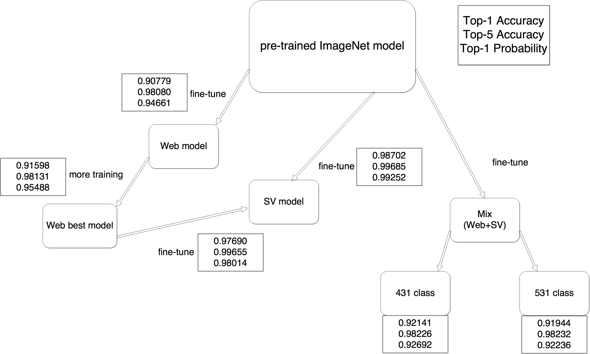

# This repository is based on [A Large-Scale Car Dataset for Fine-Grained Categorization and Verification](http://arxiv.org/abs/1506.08959)
## [The website](http://mmlab.ie.cuhk.edu.hk/datasets/comp_cars/index.html)
## [Github](https://gist.github.com/bogger/b90eb88e31cd745525ae)

### The dataset is not open. You have to follow their instructions to download it.

## Here is the summary of the paper:
*	Comprehensive Cars(CompCars)
*	208,826(total images) = 136,727(web-nature, entire car) + 27,618(web-nature, car parts) + 44481(surveillance-nature)
*	web-nature: from forums, websites
*	surveillance-nature: by cameras, front view, with bounding box, model, color
*	car hierarchy, car attributes, viewpoints, car parts
	+	Car hierarchy
		-	make(163), model(1716), year
	+	Car attributes(5)
		-	explicit(discrete values):
			*	\# doors, \# seats, type of car(12)
			*	type of car: MPV, SUV, hatchback, sedan, minibus, fastback, estate, pickup,sports, crossover, convertible, hardtop convertible
		-	implicit(continuous values):
			*	maximum speed, displacement

## Experiment Flow:

